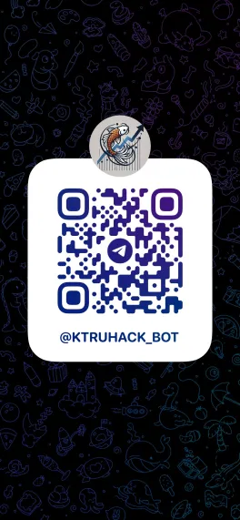
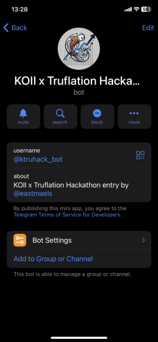

## KOII x Truflation Hackathon Entry By East

This projects aims to integrate different components with KOII nodes. 

Parts are:
1. [Node Task](https://github.com/blurtopian/truhack_x)
    - Task run on KOII Nodes
2. [Backend API](https://github.com/blurtopian/truhack_api)
    - retrieves all data 
    - submits tweets to a backend API for analysis
3. [A Telegram Mini App](https://github.com/blurtopian/truhack_tgapp)
    - accessible thru @ktruhack_bot

| QR | Intro |
| -- | -- |
|  |  |

Run the test with 
```
yarn install or npm install
yarn test or npm run test
```